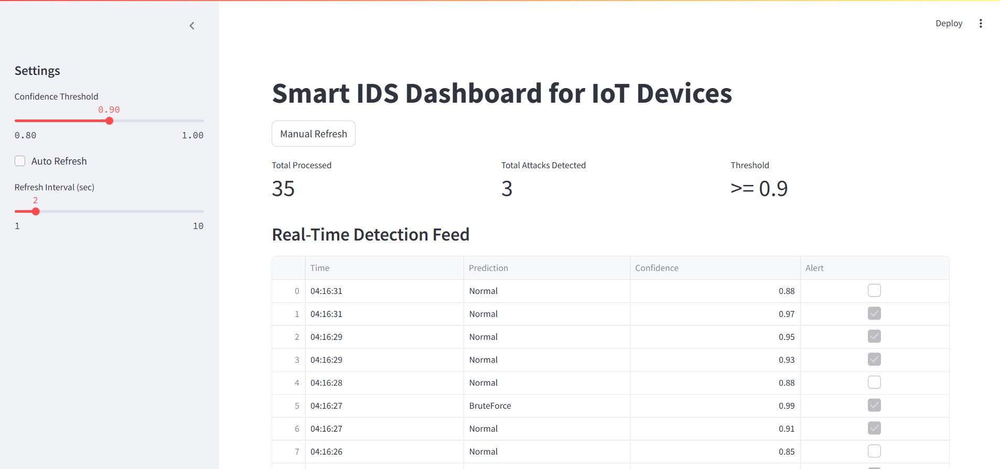

**🛡️ IntruNet: Toward Smarter IoT Security Using Deep Learning-Based IDS**

IntruNet is an AI-powered Intrusion Detection System (IDS) designed to secure IoT networks by detecting cyberattacks in real-time using deep learning and machine learning models. This project demonstrates a comparative study of multiple models including RandomForest, XGBoost, LightGBM, and a Multilayer Perceptron (MLP) on the NSL-KDD dataset.

**🚀 Project Overview**

IoT devices are vulnerable to a wide variety of attacks due to their limited computing power and security support. IntruNet addresses this by applying AI-based models to analyze network traffic and detect known and unknown threats in real time. The system is built using:

ML models: RandomForest, XGBoost, LightGBM

DL model: Multi-layer Perceptron (MLP)

Dataset: NSL-KDD

Dashboard: Built using Streamlit for live threat monitoring

**🔧 Features**

Multiclass intrusion detection (Normal, DoS, Probe, R2L, U2R)

Real-time prediction engine using a trained deep learning model

Streamlit dashboard to monitor predictions and visualize attack patterns

Precision-Recall and ROC-AUC curve analysis

Confusion matrix and classification report generation

Model persistence using joblib and .h5 formats

**🏗️ Architecture**

Data Preprocessing → Model Training → Real-Time Inference → Visualization Dashboard

**🤖 Models Used**

Model	Accuracy	Weighted F1	R2L Recall	U2R Recall	Inference Speed
RandomForest	0.74	0.70	0.04	0.01	~1ms/sample
XGBoost	0.76	0.72	0.06	0.01	~1ms/sample
LightGBM	0.67	0.62	0.03	0.00	<1ms/sample
Deep Learning	0.80	0.76	0.10	0.12	~5ms/sample (CPU)

**⚙️ Installation**

git clone https://github.com/yourusername/intrunet-iot-ids.git
cd intrunet-iot-ids
pip install -r requirements.txt

**▶️ How to Run**

1. Preprocess Dataset
Ensure the NSL-KDD dataset is available and update file paths in the script:
python preprocess.py

3. Train Models
python train_models.py

5. Run Deep Learning Model
python train_dl_model.py

7. Start Dashboard
streamlit run dashboard.py

**📊 Dashboard**

The Streamlit dashboard shows:

Predicted attack class for each incoming sample

Bar and pie charts for attack distribution

Auto-updating tracking of recent predictions

Sample-level streaming simulation with timestamp and protocol metadata

**✅ Results**

Deep Learning model achieved the highest recall for rare classes (R2L & U2R)

XGBoost is competitive in performance and faster to train

RandomForest offers interpretable results

LightGBM is optimized for speed but has lower accuracy on rare classes

Precision-Recall curves show DL outperforms all models in rare attack detection

